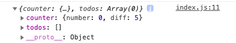

# Duck pattern Redux module
- 액션 타입, 액션 생성 함수, 리듀서를 포함
- npm i react-redux
- 만드는 순서
  - export로 액션 선언
  - export로 액션 생성 함수 선언
  - 초기 상태 선언 (initialState)
  - export default로 reducer(state=initialState, action) 선언
    - 리듀서에서는 불변값을 지키기위해 항상 기존값 가져오고 변경된 값만 바꿔준다.
  - modules에 index.js를 만들어 combineReducers()로 리듀서를 합쳐서 rootReducer 생성
  - 최상위 폴더의 index에 store 만들기
    - redux의 createSore()에 만들어둔 rootReducer를 대입
      - console.log(store.getState());
      
    - react-redux의 Provider
      - APP 컴포넌트를 Provider로 감싼다.

```javascript
  case INCREASE: // number의 값을 state를 이용해 증가
    return {
      ...state,
      number: state.number + state.diff,
    };
  case ADD_TODO: // state 배열에 변경된 todo 객체를 추가
    return state.concat(action.todo);    
```
