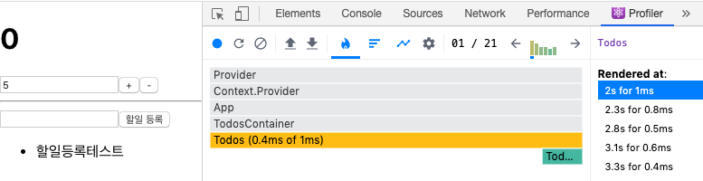

## Profiler탭
- record 버튼 클릭
- 할일 입력하고 다시 버튼 클릭
- 회색은 렌더링 되지 않음, 주황색/초록색 렌더링 됨
- 자식 컴포넌트 최적화는 memo()

;

## useSelector 최적화
- 방법1. 객체마다 useSelector를 만든다.
- 방법2. 얕은비교를 하는 리덕스의 내장함수 shallowEqual를 사용한다.

```javascript
  const { number, diff } = useSelector(state => ({
    // 매개변수 state 는 store.getState()의 return값임
    number: state.counter.number,
    diff: state.counter.diff,
  }), shallowEqual); 
```

## HOC 함수 소개

```javascript
function HOC(WrappedComponent) {
  return (props) => {
    <WrappedComponent {...props} addProps="추가프롭" />
  }
}

const Foo = ({addProps}) => {
  return <div>addProps</div>;
}

const EnhancedFoo = HOC(Foo);

const App = () => {
  return <EnhancedFoo />;
}
```

## connect, HOC 함수 소개
- connect()를 사용하면 props를 통해 리덕스의 상태 또는 액션을 디스패치하는 함수를 받아옴

```javascript
const CounterContainer = ({
  number, diff, onIncrease, onDecrease, onSetDiff
}) => {

  return (
    <div>
      <Counter
        number={number}
        diff={diff}
        onIncrease={onIncrease}
        onDecrease={onDecrease}
        onSetDiff={onSetDiff}
      />
    </div>
  );
};

// 상태를 조회하는 useSelector 역할
const mapStateToProps = (state) => ({
  number: state.counter.number,
  diff: state.counter.diff,
});

// 액션을 생성해서 dispatch 하는 역할
const mapDispatchToProps = (dispatch) => ({
  onIncrease : () => dispatch(increase()),
  onDecrease : () => dispatch(decrease()),
  onSetDiff : (diff) => dispatch(setDiff(diff)),
});
```

# bindActionCreators 사용해서 단순화
- redux의 bindActionCreators를 이용하면 mapDispatchToProps로직을 간결화 할 수 있다.
- props 매핑한 이름이 바뀌므로 바꿔준다.

```javascript
// props에 매핑한 이름 변경됬으므로 확인!
const CounterContainer = ({
  number, diff, increase, decrease, setDiff
}) => {

  return (
    <div>
      <Counter
        number={number}
        diff={diff}
        onIncrease={increase}
        onDecrease={decrease}
        onSetDiff={setDiff}
      />
    </div>
  );
};

// 상태를 조회하는 useSelector 역할
const mapStateToProps = (state) => ({
  number: state.counter.number,
  diff: state.counter.diff,
});

// 액션을 생성해서 dispatch 하는 역할
// 같은 이름으로 매핑해서 넣으므로 값 필요 없음
const mapDispatchToProps = (dispatch) => bindActionCreators({
  increase, decrease, setDiff,
}, dispatch);
```

- mapDispatchToProps를 객체로 만들면 bindActionCreators가 자동으로 동작한다.
```javascript
const mapDispatchToProps = {
  increase, decrease, setDiff,
};
```

## connect에 대해 알아두면 좋은것들

### mapStateToProps의 두번째 파라미터 ownProps
- 리덕스안에서 현재 props의 값을 참고해야 되는 상황에 사용

```javascript
<Container id={1} />

const mapStateToProps = (state, ownProps) => ({
  todos : state.todos[ownProps.id]
});
```

### connect()의 세번재 파라미터 mergeProps()
- (stateProps, dispatchProps, ownProps) => Objec
- 특정 컴포넌트한테 함수를 넣어줘야 할때, 그 함수에서 위의 값을 써야 할때

### connect()의 네번재 파라미터 options 
- 이건 쓸일 없을듯

```javascript
```

```javascript
```

```javascript
```

```javascript
```

```javascript
```
